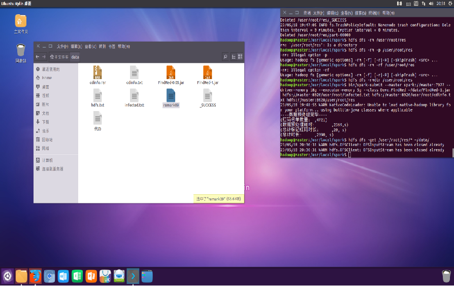

# 
 基于spark集群的健康码红码生成模拟

大数据技术基础课程项目报告
## 项目目标与需求

* 背景：新冠抗疫离不开大数据的支持，在发现感染病人后，可以通过其手机的漫游信息，发现和其行程可能有交集（都在同一个基站注册过）的人员，健康码标注为红色，促使密接人员做核酸筛查。

* 目标：根据基站出入名单记录，以及感染者名单，找到需要标红码的人员列表。

* 进一步描述需求：
  * 给出信息：cdinfo.txt文件为基站下载汇总的人员漫游信息、infected09.txt文件为发现被感染人员的手机号码。
  * 要求输出：与感染人员同时间在一个基站的手机列表，用于精确标红码，按号码升序导出到redmark09.txt文件。

## 运行环境

* 作业环境：安装Linux系统的虚拟机下。
* Spark集群配置：共5个Slave节点和1个Master节点，每个Slave节点分配20G内存以及4个CPU。
* 编程语言：Scala语言。
* 软件版本：Hadoop 3.1.x 、Java 、Scala 2.12.x、Spark 2.4.x

## 算法设计

#### 数据预处理

* 核心代码

  

  1. 载入数据并将数据转化为键值对，基站id为键，其余为值，并将离开基站的状态改为-1，以便后续计数
  2. 将数据按基站id分组后按时间戳升序排序，最后只保留手机号和状态两个数据
  3. 对RDD进行持久化处理将数据存入硬盘中，为后续处理节省时间
  4. 最后得到的数据：Key：基站idValue：List（(手机号，状态)）

* 数据预处理DAG图

  

#### 算法流程

1. 读取感染者名单
2. 使用broadcast函数将感染者名单广播到集群工作节点
3. 使用flapMap对每个基站的数据，通过计数器进行红码人员查找，生成红码人员列表，返回时自动合并红码名单
4. 去重、与感染者名单合并、按升序排序
5. 将结果保存到 HDFS 中

#### 关键算法解析（第三步）

* 输入：以基站分组的记录，每条记录是按照时间顺序排列的二元组（手机号，出入状态）

* 输出：全部基站的红码名单

  

* 全过程DAG图:

  

## 结果

1. 红码名单数量：4721
2. 数据预处理耗时：39min
3. 总计标记红码时长：20s
4. 总计时长：39min20s

## 项目亮点

1. 数据预处理使得数据按时间轴顺序化，减少后续查找红码人员的迭代次数，为后续双指针处理数据提供前提条件。
2. 预处理后序列化地持久化到内存、磁盘，将总体的作业时间更多分配在预处理阶段。
3. 计数器cnt数组的设计有效记录了当前基站感染人员数量，对其他人员实时加入红码名单。在高度压缩感染区间判断的同时，保留了每个号码的独特性，以此来区分感染区间的所属，避免了只进不出或者只出不进情况的错误判断。